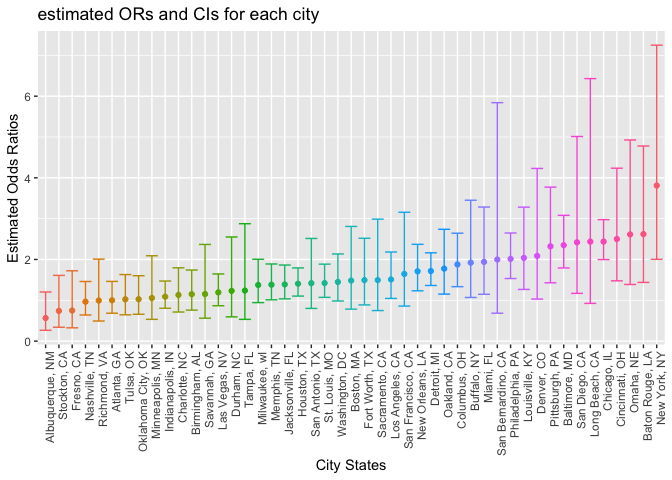
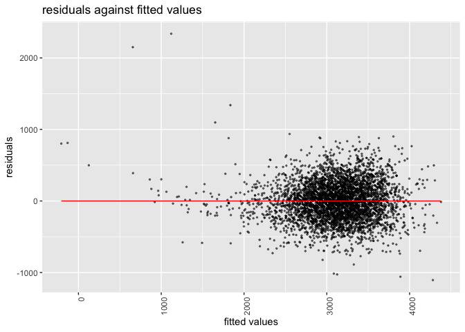

p8105_hw6_yl4610
================
Yuxin Liu
2022-11-21

``` r
library(tidyverse)
library(modelr)
library(skimr)
```

# Question 2

``` r
homicide_raw = 
  read_csv( "./data/homicide_data.csv") %>% 
    mutate (
    city_state = str_c(city, ", ", state),
    result = ifelse(disposition != "Closed by arrest", "unsolved", "solved")) %>% 
    filter(!(city_state %in% c("Tulsa, AL", "Dallas, TX", "Phoenix, AZ", "Kansas City, MO"))) %>% 
    filter(victim_race %in% c("White", "Black")) %>% 
    filter(!(victim_age %in% c("Unknown"))) %>% 
    mutate (victim_age = as.numeric(victim_age))

homicide_raw 
```

    ## # A tibble: 39,403 × 14
    ##    uid   repor…¹ victi…² victi…³ victi…⁴ victi…⁵ victi…⁶ city  state   lat   lon
    ##    <chr>   <dbl> <chr>   <chr>   <chr>     <dbl> <chr>   <chr> <chr> <dbl> <dbl>
    ##  1 Alb-…  2.01e7 SATTER… VIVIANA White        15 Female  Albu… NM     35.1 -107.
    ##  2 Alb-…  2.01e7 MULA    VIVIAN  White        72 Female  Albu… NM     35.1 -107.
    ##  3 Alb-…  2.01e7 BOOK    GERALD… White        91 Female  Albu… NM     35.2 -107.
    ##  4 Alb-…  2.01e7 MARTIN… GUSTAVO White        56 Male    Albu… NM     35.1 -107.
    ##  5 Alb-…  2.01e7 GRAY    STEFAN… White        43 Female  Albu… NM     35.1 -107.
    ##  6 Alb-…  2.01e7 DAVID   LARRY   White        52 Male    Albu… NM     NA     NA 
    ##  7 Alb-…  2.01e7 BRITO   ELIZAB… White        22 Female  Albu… NM     35.1 -107.
    ##  8 Alb-…  2.01e7 KING    TEVION  Black        15 Male    Albu… NM     35.1 -107.
    ##  9 Alb-…  2.01e7 BOYKIN  CEDRIC  Black        25 Male    Albu… NM     35.1 -107.
    ## 10 Alb-…  2.01e7 BARRAG… MIGUEL  White        20 Male    Albu… NM     35.1 -107.
    ## # … with 39,393 more rows, 3 more variables: disposition <chr>,
    ## #   city_state <chr>, result <chr>, and abbreviated variable names
    ## #   ¹​reported_date, ²​victim_last, ³​victim_first, ⁴​victim_race, ⁵​victim_age,
    ## #   ⁶​victim_sex

I used mutate to create a city_state variable and a binary variable
indicating whether the homicide is solved. I used filter to omit cities
Dallas, TX; Phoenix, AZ; and Kansas City, MO; Tulsa, AL. Also, I used
filter to limit victim_race as White or Black and delete unknown age.
Lastly, I used mutate to change victim_age to numeric format.

``` r
Baltimore_reg = 
 homicide_raw %>% 
  filter(city_state == "Baltimore, MD") %>%
  mutate (y_var = ifelse(result == "solved",0,1)) %>% 
    glm(y_var ~ victim_age + victim_sex + victim_race, data =., family = 'binomial'(link='logit')) %>% 
    broom::tidy () %>% 
    mutate(odds_ratio = exp(estimate),
           lower_bound = exp(estimate - 1.96 * std.error),
           upper_bound = exp(estimate + 1.96 * std.error)) %>% 
    select(term, estimate, odds_ratio, lower_bound,upper_bound ) %>% 
    filter(term == "victim_sexMale") 

Baltimore_reg
```

    ## # A tibble: 1 × 5
    ##   term           estimate odds_ratio lower_bound upper_bound
    ##   <chr>             <dbl>      <dbl>       <dbl>       <dbl>
    ## 1 victim_sexMale    0.854       2.35        1.79        3.08

For the city of Baltimore, MD, I used the glm function to fit a logistic
regression with resolved vs unresolved as the outcome and victim age,
sex and race as predictors. Save the output of glm as an R object; apply
the broom::tidy to this object; and obtain the estimate and confidence
interval of the adjusted odds ratio for solving homicides comparing male
victims to female victims keeping all other variables fixed.

``` r
homicide_all_cities = 
  homicide_raw %>% 
  mutate (y_var = ifelse(result == "solved",0,1)) %>%
  nest(data = -city_state) %>% 
  mutate(
    glm_all_cities = map(data, ~glm(y_var ~ victim_age + victim_sex + victim_race, data = ., family = 'binomial'(link='logit'))),
    final_results = map(glm_all_cities, broom::tidy)) %>% 
  unnest(final_results) %>% 
  mutate(
    odds_ratio = exp(estimate),
    lower_bound = exp(estimate - 1.96 * std.error),
    upper_bound = exp(estimate + 1.96 * std.error)) %>% 
  filter(term == "victim_sexMale") %>% 
  select(city_state, odds_ratio, lower_bound,upper_bound) 

homicide_all_cities
```

    ## # A tibble: 47 × 4
    ##    city_state      odds_ratio lower_bound upper_bound
    ##    <chr>                <dbl>       <dbl>       <dbl>
    ##  1 Albuquerque, NM      0.566       0.266        1.20
    ##  2 Atlanta, GA          1.00        0.683        1.46
    ##  3 Baltimore, MD        2.35        1.79         3.08
    ##  4 Baton Rouge, LA      2.62        1.44         4.78
    ##  5 Birmingham, AL       1.15        0.759        1.74
    ##  6 Boston, MA           1.48        0.784        2.81
    ##  7 Buffalo, NY          1.92        1.07         3.45
    ##  8 Charlotte, NC        1.13        0.713        1.80
    ##  9 Chicago, IL          2.44        2.00         2.98
    ## 10 Cincinnati, OH       2.50        1.48         4.24
    ## # … with 37 more rows

I run glm for each of the cities, and extract the adjusted odds ratio
(and CI) for solving homicides comparing male victims to female victims.
I did this within a “tidy” pipeline, making use of purrr::map, list
columns, and unnest to create a dataframe with estimated ORs and CIs for
each city.

``` r
homicide_plot = 
  homicide_all_cities %>% 
    mutate(city_state = fct_reorder(city_state, odds_ratio)) %>% 
    ggplot(aes(x = city_state, y = odds_ratio, color = city_state)) + 
    geom_point() + 
    geom_errorbar(aes(ymin = lower_bound, ymax = upper_bound)) + 
    theme(axis.text.x = element_text(angle=90, hjust = 1)) + 
    labs(x = "City States",
         y = "Estimated Odds Ratios",
         title = "estimated ORs and CIs for each city") +
    theme(legend.position = "none") 

homicide_plot
```

<!-- -->

I created a plot that shows the estimated ORs and CIs for each city.
Then I organized cities according to estimated OR. This scatter plot
shows that New York, NY has the highest estimated odds ratio for solving
homicides comparing male victims to female victims keeping all other
variables fixed, while Albuquerque, NM has the lowest estimated odds
ratio.

# Question 3

``` r
birthweight_raw = 
  read_csv("./data/birthweight.csv") %>% 
    mutate(
    babysex = as.factor(babysex),
    frace = as.factor(frace),
    malform = as.factor(malform),
    mrace = as.factor(mrace))
```

``` r
skimr::skim(birthweight_raw) 
```

|                                                  |                 |
|:-------------------------------------------------|:----------------|
| Name                                             | birthweight_raw |
| Number of rows                                   | 4342            |
| Number of columns                                | 20              |
| \_\_\_\_\_\_\_\_\_\_\_\_\_\_\_\_\_\_\_\_\_\_\_   |                 |
| Column type frequency:                           |                 |
| factor                                           | 4               |
| numeric                                          | 16              |
| \_\_\_\_\_\_\_\_\_\_\_\_\_\_\_\_\_\_\_\_\_\_\_\_ |                 |
| Group variables                                  | None            |

Data summary

**Variable type: factor**

| skim_variable | n_missing | complete_rate | ordered | n_unique | top_counts                      |
|:--------------|----------:|--------------:|:--------|---------:|:--------------------------------|
| babysex       |         0 |             1 | FALSE   |        2 | 1: 2230, 2: 2112                |
| frace         |         0 |             1 | FALSE   |        5 | 1: 2123, 2: 1911, 4: 248, 3: 46 |
| malform       |         0 |             1 | FALSE   |        2 | 0: 4327, 1: 15                  |
| mrace         |         0 |             1 | FALSE   |        4 | 1: 2147, 2: 1909, 4: 243, 3: 43 |

**Variable type: numeric**

| skim_variable | n_missing | complete_rate |    mean |     sd |     p0 |     p25 |     p50 |     p75 |   p100 | hist  |
|:--------------|----------:|--------------:|--------:|-------:|-------:|--------:|--------:|--------:|-------:|:------|
| bhead         |         0 |             1 |   33.65 |   1.62 |  21.00 |   33.00 |   34.00 |   35.00 |   41.0 | ▁▁▆▇▁ |
| blength       |         0 |             1 |   49.75 |   2.72 |  20.00 |   48.00 |   50.00 |   51.00 |   63.0 | ▁▁▁▇▁ |
| bwt           |         0 |             1 | 3114.40 | 512.15 | 595.00 | 2807.00 | 3132.50 | 3459.00 | 4791.0 | ▁▁▇▇▁ |
| delwt         |         0 |             1 |  145.57 |  22.21 |  86.00 |  131.00 |  143.00 |  157.00 |  334.0 | ▅▇▁▁▁ |
| fincome       |         0 |             1 |   44.11 |  25.98 |   0.00 |   25.00 |   35.00 |   65.00 |   96.0 | ▃▇▅▂▃ |
| gaweeks       |         0 |             1 |   39.43 |   3.15 |  17.70 |   38.30 |   39.90 |   41.10 |   51.3 | ▁▁▂▇▁ |
| menarche      |         0 |             1 |   12.51 |   1.48 |   0.00 |   12.00 |   12.00 |   13.00 |   19.0 | ▁▁▂▇▁ |
| mheight       |         0 |             1 |   63.49 |   2.66 |  48.00 |   62.00 |   63.00 |   65.00 |   77.0 | ▁▁▇▂▁ |
| momage        |         0 |             1 |   20.30 |   3.88 |  12.00 |   18.00 |   20.00 |   22.00 |   44.0 | ▅▇▂▁▁ |
| parity        |         0 |             1 |    0.00 |   0.10 |   0.00 |    0.00 |    0.00 |    0.00 |    6.0 | ▇▁▁▁▁ |
| pnumlbw       |         0 |             1 |    0.00 |   0.00 |   0.00 |    0.00 |    0.00 |    0.00 |    0.0 | ▁▁▇▁▁ |
| pnumsga       |         0 |             1 |    0.00 |   0.00 |   0.00 |    0.00 |    0.00 |    0.00 |    0.0 | ▁▁▇▁▁ |
| ppbmi         |         0 |             1 |   21.57 |   3.18 |  13.07 |   19.53 |   21.03 |   22.91 |   46.1 | ▃▇▁▁▁ |
| ppwt          |         0 |             1 |  123.49 |  20.16 |  70.00 |  110.00 |  120.00 |  134.00 |  287.0 | ▅▇▁▁▁ |
| smoken        |         0 |             1 |    4.15 |   7.41 |   0.00 |    0.00 |    0.00 |    5.00 |   60.0 | ▇▁▁▁▁ |
| wtgain        |         0 |             1 |   22.08 |  10.94 | -46.00 |   15.00 |   22.00 |   28.00 |   89.0 | ▁▁▇▁▁ |

There is no missing data. I Loaded and cleaned the data for regression
analysis (i.e. convert numeric to factor where appropriate, check for
missing data, etc.).

``` r
model = lm(bwt ~ ., data = birthweight_raw) 

model%>%
  broom::tidy() %>% 
  knitr::kable(digits = 4)
```

| term        |   estimate | std.error | statistic | p.value |
|:------------|-----------:|----------:|----------:|--------:|
| (Intercept) | -6265.3914 |  660.4011 |   -9.4873 |  0.0000 |
| babysex2    |    28.7073 |    8.4652 |    3.3912 |  0.0007 |
| bhead       |   130.7781 |    3.4523 |   37.8812 |  0.0000 |
| blength     |    74.9536 |    2.0217 |   37.0752 |  0.0000 |
| delwt       |     4.1007 |    0.3948 |   10.3863 |  0.0000 |
| fincome     |     0.2898 |    0.1795 |    1.6142 |  0.1066 |
| frace2      |    14.3313 |   46.1501 |    0.3105 |  0.7562 |
| frace3      |    21.2361 |   69.2960 |    0.3065 |  0.7593 |
| frace4      |   -46.9962 |   44.6782 |   -1.0519 |  0.2929 |
| frace8      |     4.2969 |   74.0741 |    0.0580 |  0.9537 |
| gaweeks     |    11.5494 |    1.4654 |    7.8816 |  0.0000 |
| malform1    |     9.7650 |   70.6259 |    0.1383 |  0.8900 |
| menarche    |    -3.5508 |    2.8951 |   -1.2265 |  0.2201 |
| mheight     |     9.7874 |   10.3116 |    0.9492 |  0.3426 |
| momage      |     0.7593 |    1.2221 |    0.6213 |  0.5344 |
| mrace2      |  -151.4354 |   46.0453 |   -3.2888 |  0.0010 |
| mrace3      |   -91.3866 |   71.9190 |   -1.2707 |  0.2039 |
| mrace4      |   -56.4787 |   45.1369 |   -1.2513 |  0.2109 |
| parity      |    95.5411 |   40.4793 |    2.3602 |  0.0183 |
| pnumlbw     |         NA |        NA |        NA |      NA |
| pnumsga     |         NA |        NA |        NA |      NA |
| ppbmi       |     4.3538 |   14.8913 |    0.2924 |  0.7700 |
| ppwt        |    -3.4716 |    2.6121 |   -1.3290 |  0.1839 |
| smoken      |    -4.8544 |    0.5871 |   -8.2690 |  0.0000 |
| wtgain      |         NA |        NA |        NA |      NA |

``` r
regression_model = lm(bwt ~ babysex + bhead + blength + delwt + gaweeks + mheight + mrace + parity + ppwt + smoken, data = birthweight_raw) 

regression_model %>% 
  broom::tidy() %>% 
  knitr::kable(digits = 4)
```

| term        |   estimate | std.error | statistic | p.value |
|:------------|-----------:|----------:|----------:|--------:|
| (Intercept) | -6101.8188 |  137.5732 |  -44.3532 |  0.0000 |
| babysex2    |    28.3735 |    8.4565 |    3.3552 |  0.0008 |
| bhead       |   131.0228 |    3.4448 |   38.0345 |  0.0000 |
| blength     |    74.7933 |    2.0178 |   37.0664 |  0.0000 |
| delwt       |     4.0840 |    0.3920 |   10.4193 |  0.0000 |
| gaweeks     |    11.6785 |    1.4617 |    7.9897 |  0.0000 |
| mheight     |     6.8569 |    1.7795 |    3.8532 |  0.0001 |
| mrace2      |  -145.3753 |    9.2256 |  -15.7578 |  0.0000 |
| mrace3      |   -77.9781 |   42.2918 |   -1.8438 |  0.0653 |
| mrace4      |  -105.9871 |   19.1083 |   -5.5466 |  0.0000 |
| parity      |    94.8103 |   40.3386 |    2.3504 |  0.0188 |
| ppwt        |    -2.6507 |    0.4273 |   -6.2041 |  0.0000 |
| smoken      |    -4.8738 |    0.5855 |   -8.3242 |  0.0000 |

``` r
regression_model
```

    ## 
    ## Call:
    ## lm(formula = bwt ~ babysex + bhead + blength + delwt + gaweeks + 
    ##     mheight + mrace + parity + ppwt + smoken, data = birthweight_raw)
    ## 
    ## Coefficients:
    ## (Intercept)     babysex2        bhead      blength        delwt      gaweeks  
    ##   -6101.819       28.374      131.023       74.793        4.084       11.679  
    ##     mheight       mrace2       mrace3       mrace4       parity         ppwt  
    ##       6.857     -145.375      -77.978     -105.987       94.810       -2.651  
    ##      smoken  
    ##      -4.874

I proposed a regression model for birthweight. Describe your modeling
process

``` r
residual_plot =
  birthweight_raw %>% 
  modelr::add_predictions(regression_model) %>% 
  modelr::add_residuals(regression_model) %>%
  ggplot(aes(x = pred, y = resid)) + 
  geom_point(alpha = 0.5, cex=0.5) +
  labs(
    title = "residuals against fitted values",
    x = "fitted values",
    y = "residuals") +
  theme(axis.text.x = element_text(angle=90, hjust = 1)) +
  geom_line(aes(y = 0), color = "red") 

residual_plot
```

<!-- -->

I created a plot of model residuals against fitted values – use
add_predictions and add_residuals.

``` r
compare_model1 = lm(bwt ~ blength + gaweeks, data = birthweight_raw) 

compare_model1 %>% 
  broom::tidy() %>% 
  knitr::kable(digits = 4)
```

| term        |   estimate | std.error | statistic | p.value |
|:------------|-----------:|----------:|----------:|--------:|
| (Intercept) | -4347.6671 |   97.9584 |  -44.3828 |       0 |
| blength     |   128.5557 |    1.9899 |   64.6044 |       0 |
| gaweeks     |    27.0467 |    1.7179 |   15.7438 |       0 |

``` r
compare_model2 = lm(bwt ~  bhead + blength + babysex + bhead * blength + bhead * babysex + blength * babysex + bhead * blength * babysex, data = birthweight_raw) 

compare_model2 %>% 
  broom::tidy() %>% 
  knitr::kable(digits = 4)
```

| term                   |   estimate | std.error | statistic | p.value |
|:-----------------------|-----------:|----------:|----------:|--------:|
| (Intercept)            | -7176.8170 | 1264.8397 |   -5.6741 |  0.0000 |
| bhead                  |   181.7956 |   38.0542 |    4.7773 |  0.0000 |
| blength                |   102.1269 |   26.2118 |    3.8962 |  0.0001 |
| babysex2               |  6374.8684 | 1677.7669 |    3.7996 |  0.0001 |
| bhead:blength          |    -0.5536 |    0.7802 |   -0.7096 |  0.4780 |
| bhead:babysex2         |  -198.3932 |   51.0917 |   -3.8831 |  0.0001 |
| blength:babysex2       |  -123.7729 |   35.1185 |   -3.5244 |  0.0004 |
| bhead:blength:babysex2 |     3.8781 |    1.0566 |    3.6702 |  0.0002 |

I compared the model to two others: One using length at birth and
gestational age as predictors (main effects only). One using head
circumference, length, sex, and all interactions (including the
three-way interaction) between these.
